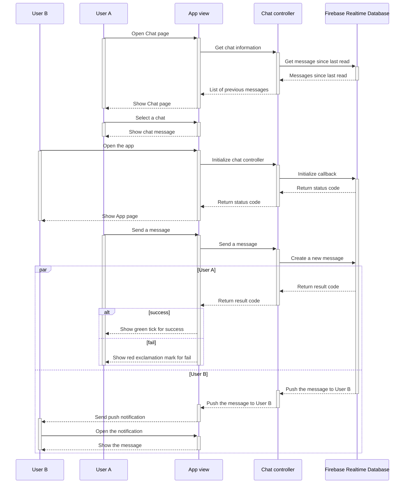

# UML Sequence Diagram

```mermaid
sequenceDiagram
    participant User B
    participant User A
    participant App view
    participant Chat controller
    participant Firebase Realtime Database

%% Open chat page
    User A->>+App view: Open Chat page
    activate User A
        App view->>+Chat controller: Get chat information
        Chat controller->>+Firebase Realtime Database: Get message since last read
        Firebase Realtime Database-->>-Chat controller: Messages since last read
        Chat controller-->>-App view: List of previous messages
        App view-->>-User A: Show Chat page
    deactivate User A

%% Open a chat from list
    User A->>+App view: Select a chat
    activate User A
        App view-->>-User A: Show chat message
    deactivate User A

%% Register a message call back
    User B->>+App view: Open the app
    activate User B
        App view->>+Chat controller: Initialize chat controller
        Chat controller->>+Firebase Realtime Database: Initialize callback
        Firebase Realtime Database-->>Chat controller: Return status code
        Chat controller-->>-App view: Return status code
        App view-->>-User B: Show App page
    deactivate User B

%% Send message
    User A->>App view: Send a message
    activate User A
    activate App view
    App view->>+Chat controller: Send a message
    Chat controller->>Firebase Realtime Database: Create a new message
    par User A
        Firebase Realtime Database-->>Chat controller: Return result code
        Chat controller-->>-App view: Return result code
        alt success
        App view-->>User A: Show green tick for success
        else fail
        App view-->>User A: Show red exclamation mark for fail
        end
        deactivate App view
        deactivate User A

%% Receive a message
    and User B
        Firebase Realtime Database-->>+Chat controller: Push the message to User B
        deactivate Firebase Realtime Database
        Chat controller-->>+App view: Push the message to User B
        deactivate Chat controller
        App view-->>+User B: Send push notification
        deactivate App view
        User B->>+App view: Open the notification
        App view-->>-User B: Show the message
        deactivate User B
    end
```
