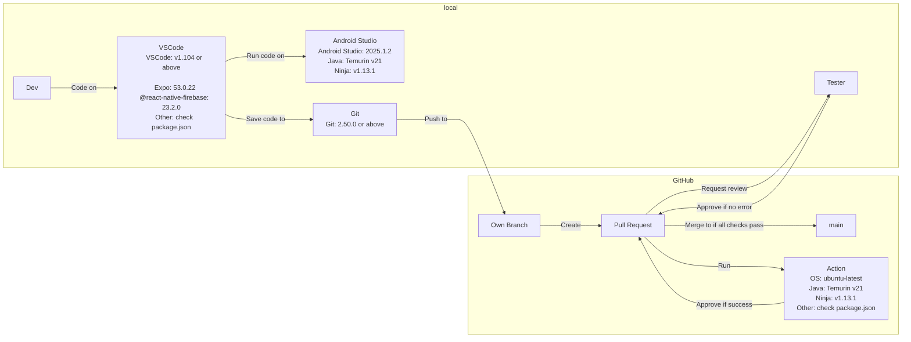

# Development environment

## VSCode

We use VSCode as our IDE to edit code. It is free and flexible.

## Expo

We decided to use expo for our framework, because it only need JS or TS codes to create a phone APP. It is easier to learn TS compared to other programming languages.

## @react-native-firebase

We use Firebase as our backend service. Compared to the official Firebase SDK, @react-native-firebase is more suitable for React Native projects.

## Java, Ninja, Android Studio

These are required by expo to build the APP.

Android Studio's SDK is required to build the Android APP. It's emulator enables us to test the APP with same environment across different developers.

Java is required by Android Studio.

Ninja that shipped with Android Studio is too old and cannot handle long path names on Windows. So I mentioned the version explicitly.

## Git

We use Git for version control. We are required to use GitHub to host our code, and GitHub has stopped support for Subversion, so the only choice is Git.

## OS for GitHub Actions

We decided to use Ubuntu for GitHub Actions, because Linux usually has less bugs compared to Windows. E.g., Linux does not have the path length issue compared to Windows. It is also a chance for us to test our code compiles on Linux.
