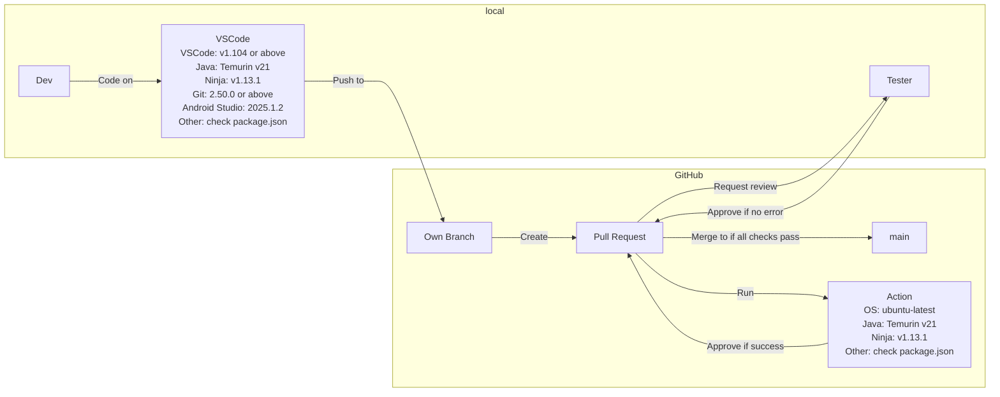

# UML

## Component Diagram (By Bozhan)

## Class Diagram (By Jason)

## Sequence Diagram (By Bozhan)

## Development environment (By Bozhan)

```mermaid
flowchart LR
    subgraph local
    Dev
    Tester

    VSCode[VSCode
    VSCode: v1.104 or above
    Java: Temurin v21
    Ninja: v1.13.1
    Git: 2.50.0 or above
    Android Studio: 2025.1.2
    Other: check package.json]

    Dev -- Code on ---> VSCode
    end

    subgraph GitHub
    OwnBranch[Own Branch]
    main
    PR[Pull Request]
    action[Action
    OS: ubuntu-latest
    Java: Temurin v21
    Ninja: v1.13.1
    Other: check package.json]

    VSCode -- Push to ---> OwnBranch
    OwnBranch -- Create ---> PR

    PR -- Run ---> action
    PR -- Request review ---> Tester

    action -- Approve if success ---> PR
    Tester -- Approve if no error ---> PR

    PR -- Merge to if all checks pass ---> main
    end
```
