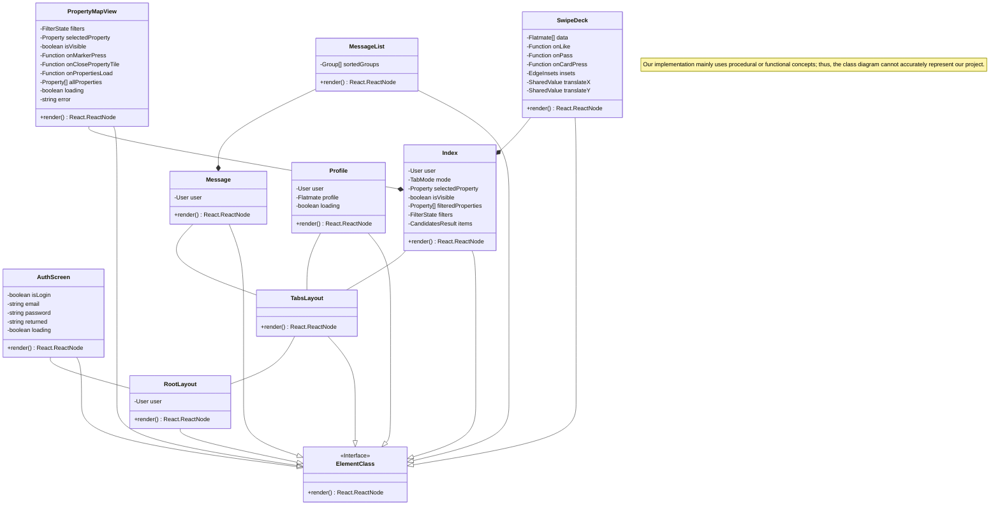

# UML Class Diagram

```mermaid
classDiagram
    note "Our implementation mainly uses procedural or functional concepts; thus, the class diagram cannot accurately represent our project."

    class ElementClass {
        <<Interface>>
        +render() React.ReactNode
    }

    class RootLayout {
        -User user

        +render() React.ReactNode
    }

    class AuthScreen {
        -boolean isLogin
        -string email
        -string password
        -string returned
        -boolean loading

        +render() React.ReactNode
    }

    class TabsLayout {
        +render() React.ReactNode
    }

    class Index {
        -User user
        -TabMode mode
        -Property selectedProperty
        -boolean isVisible
        -Property[] filteredProperties
        -FilterState filters
        -CandidatesResult items

        +render() React.ReactNode
    }

    class Message {
        -User user

        +render() React.ReactNode
    }

    class Profile {
        -User user
        -Flatmate profile
        -boolean loading

        +render() React.ReactNode
    }

    class MessageList {
        -Group[] sortedGroups

        +render() React.ReactNode
    }

    class SwipeDeck {
        -Flatmate[] data
        -Function onLike
        -Function onPass
        -Function onCardPress
        -EdgeInsets insets
        -SharedValue<number> translateX
        -SharedValue<number> translateY

        +render() React.ReactNode
    }

    class PropertyMapView {
        -FilterState filters
        -Property selectedProperty
        -boolean isVisible
        -Function onMarkerPress
        -Function onClosePropertyTile
        -Function onPropertiesLoad
        -Property[] allProperties
        -boolean loading
        -string error

        +render() React.ReactNode
    }

    RootLayout --|> ElementClass
    AuthScreen --|> ElementClass
    TabsLayout --|> ElementClass
    Index --|> ElementClass
    Message --|> ElementClass
    Profile --|> ElementClass
    MessageList --|> ElementClass
    SwipeDeck --|> ElementClass
    PropertyMapView --|> ElementClass

    AuthScreen -- RootLayout
    TabsLayout -- RootLayout

    Index -- TabsLayout
    Message -- TabsLayout
    Profile -- TabsLayout

    SwipeDeck --* Index
    PropertyMapView --* Index

    MessageList --* Message
```
